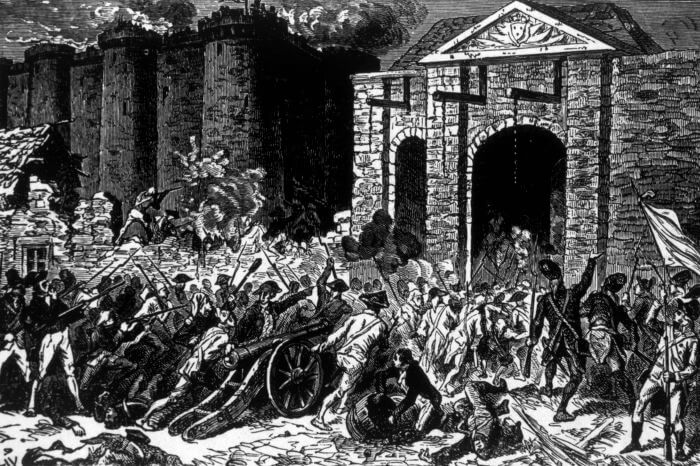
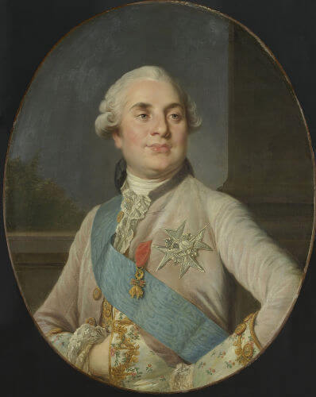
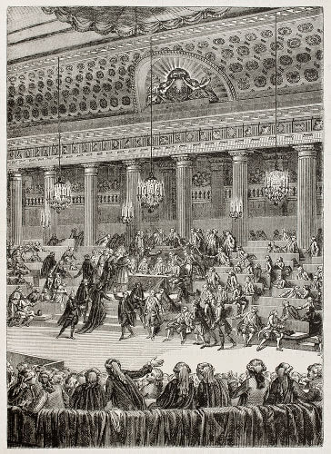
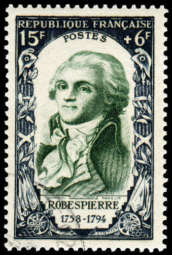

# A Revolução Francesa

# Escola: Gildo Veríssimo 
# Disciplina: Português 
# Professor: Marcos
# Turma: 8° ano B
# Aluna: Ketilly Maria
# Data: 21/09/22
---

# __A REVOLUÇÃO FRANCESA__
---

A Revolução Francesa, um dos maiores acontecimentos da humanidade, foi um processo revolucionário inspirado em ideais iluministas contra a monarquia absolutista.

 

```A Revolução Francesa teve como grande marco a Queda da Bastilha, que aconteceu no dia 14 de julho de 1789.```


A __Revolução Francesa__ foi um ciclo revolucionário de grandes proporções que se espalhou pela França e aconteceu entre 1789 e 1799. Foi inspirada nos ideais do Iluminismo e motivada pela situação de crise que a França vivia no final do século XVIII. Causou também profundas transformações e marcou o início da queda do absolutismo na Europa.


---


## __Resumo__


---

Dentre os principais acontecimentos e informações relativos à Revolução Francesa, podem ser destacados:

• A Revolução Francesa retirou sua base ideológica dos ideais iluministas.
Antes da revolução, a França era uma monarquia absolutista governada por Luís XVI.

• Antes da revolução, a França era uma monarquia absolutista governada por Luís XVI.

• A França vivia uma intensa crise econômica durante as décadas de 1770 e 1780, e essa, em partes, motivou o início da revolução.

• O estopim que espalhou o ímpeto revolucionário pela França foi a Queda da Bastilha, que aconteceu em 14 de julho de 1789.

• Ao longo da revolução, a França viveu as seguintes fases: Assembleia Nacional Constituinte, Assembleia Legislativa, Convenção Nacional e Diretório.

• Os principais partidos eram girondinos, defensores de que medidas conservadoras fossem realizadas, e jacobinos, defensores de que profundas transformações sociais, econômicas e políticas acontecessem.

• Durante o período do terror, os jacobinos, liderados por Maximilien Robespierre, guilhotinaram milhares de opositores.

• Os girondinos derrubaram os jacobinos do poder por meio de um golpe conhecido como Reação Termidoriana.

• A Revolução Francesa encerrou-se por meio do golpe organizado por Napoleão Bonaparte e conhecido como Golpe do 18 de Brumário


---

## __Causas__

---

 

```Luís XVI era o rei francês durante a década de 1780.```

A Revolução Francesa foi resultado direto da crise que a França vivia no final do século XVIII. A insatisfação popular (com a crise econômica e política que o país vivia) aliou-se com os interesses da burguesia em implantar no país as ideias do Iluminismo como forma de combater os privilégios da aristocracia francesa.

No final do século XVIII, a França era uma monarquia absolutista em que o rei era Luís XVI. O poder de Luís XVI, como em todo regime absolutista, era pleno, e a sociedade francesa era dividida em grupos sociais muito bem definidos. A composição social da França era a seguinte:

__• Primeiro Estado:__ clero;
__• Segundo Estado:__ nobreza;
__• Terceiro Estado:__ restante da população.

Essa divisão social na França tinha uma clara desigualdade social, uma vez que Primeiro e Segundo Estados possuíam privilégios que não se estendiam ao Terceiro Estado. O destaque vai para as isenções de impostos que ambas as classes possuíam e para o direito de alguns nobres de poderem cobrar impostos dos camponeses que trabalhavam em suas terras.

O Terceiro Estado, por sua vez, era um grupo bastante heterogêneo, isto é, composto por diferentes grupos, como a burguesia e os camponeses (os segundos correspondiam a 80% da população francesa). Os camponeses viviam na pobreza ao passo que a aristocracia francesa vivia uma vida de luxo. Para os burgueses, os privilégios da aristocracia do país eram um entrave para o desenvolvimento de seus negócios. A desigualdade social é a primeira causa da revolução.

Toda essa situação de desigualdade agravou-se com a crise social que existia na França. A crise econômica francesa era motivada pelos elevados gastos do país (o governo francês gastava 20% a mais do que arrecadava). Esses gastos foram agravados pelo envolvimento do país em conflitos no exterior. A existência de privilégios de classe no país também contribuía para a crise.

A crise econômica na França aumentava a pressão, principalmente, para as classes de baixo, uma vez que o custo de vida aumentou, a oferta de empregos foi reduzida, e os impostos cobrados pela nobreza aumentaram. Essa situação, em si, já era o suficiente para levar os camponeses à fome, mas, em 1788 e 1789, o país ainda enfrentou um inverno rigoroso, que prejudicou as colheitas e contribuiu para que o alimento ficasse mais caro ainda.

Tentativas de reforma haviam sido propostas, mas não avançaram porque a aristocracia francesa havia mostrado-se resistente às possibilidades de reformas que viessem a retirar parte de seus privilégios. Assim, em 1789, a França vivia uma situação complicada, pois a crise econômica era grave, e a pobreza e a fome levaram a população a um estado de quase rebelião.

O resultado encontrado pela nobreza francesa foi convocar os Estados Gerais, uma reunião criada na França feudal e que era convocada só em momentos de emergência. Essa saída era agradável para a aristocracia francesa, pois, nos moldes antigos do Estado Geral, Primeiro e Segundo Estados uniam-se contra o Terceiro Estado.

O Terceiro Estado, porém, não estava disposto a manter-se nos Estados Gerais dentro dos moldes em que ele funcionava em tempos passados. Com isso, foi proposto pelos representantes desse Estado uma alteração no funcionamento dos Estados Gerais. Em vez de o voto ser por Estado, foi proposto que ele fosse individual, isto é, todos os membros dos Estados (incluindo os mais de 500 do Terceiro Estado) teriam direito ao voto.

O rei francês não aceitou a proposta e, assim, o Terceiro Estado rompeu com os Estados Gerais e fundou a Assembleia Nacional Constituinte, com o propósito de redigir uma Constituição que proporia mudanças para a França, tornando-a uma monarquia constitucional. Quando Luís XVI tentou fechar a Constituinte à força, a população parisiense rebelou-se em sua defesa.

No dia 12 de julho de 1789, a população francesa tomou as ruas de Paris. No dia 13, foi criado uma Comuna para governar Paris e uma Guarda Nacional, espécie de milícia popular. No dia 14, a população partiu para tomar armas e pólvora do governo e, com isso, atacou a Bastilha, antiga fortaleza convertida em prisão que era usada para aprisionar opositores dos reis franceses.

No dia 14 de julho, então, houve a Queda da Bastilha, em que a população francesa invadiu e tomou o controle da prisão que era o símbolo da opressão absolutista. Depois disso, a revolução espalhou-se pelo país, alcançando novas cidades e chegando ao campo.


• __Iluminismo__

---


A Revolução Francesa inspirou-se nos ideais iluministas, que defendiam que a autoridade deveria  basear-se na razão. Os iluministas defendiam ideais como liberdade e constitucionalismo, eram fortes defensores da separação entre Igreja e Estado e, além disso, eram opositores da monarquia absolutista e defensores do método científico. As revoluções burguesas do século XVIII — americana e francesa — tiraram dos ideais iluministas a sua base ideológica.

Acesse também: Veja as críticas do filósofo Edmund Burke à Revolução Francesa


---


## __Etapas da Revolução Francesa__


---


Depois da Queda da Bastilha, o processo de revolução espalhou-se pela França e estendeu-se pelos dez anos seguintes, sendo somente encerrado quando Napoleão Bonaparte assumiu o poder do país por meio do Golpe de 18 de Brumário. A Revolução Francesa pode ser dividida dentro do período das instituições políticas que atuaram no país:


• Assembleia Nacional Constituinte Assembleia Legislativa (1789-1792);

• Convenção Nacional (1792-1795);

• Diretório (1795-1799).


---


## __• Assembleia Constituinte e Assembleia Legislativa__


---


Trata-se do período inicial da Revolução Francesa, o qual foi marcado por grandes transformações, por meio da redação de uma Constituição para a França e pela atuação da Assembleia Legislativa. Após a Queda da Bastilha, muitos camponeses, no interior do país, temendo ficar sem alimentos e muito endividados, partiram para o ataque.

Esse foi o período do Grande Medo, que ocorreu entre julho e agosto de 1789, e durante o qual camponeses começaram a atacar aristocratas e suas propriedades. Assim, residências da nobreza foram invadidas, saqueadas e destruídas, cartórios foram atacados para que os títulos de propriedade fossem destruídos etc. Os camponeses exigiam o fim de alguns impostos e maior acesso aos alimentos.

A burguesia francesa, temendo esse ímpeto popular, resolveu tomar decisões que aceleraram as transformações na França e que tinham como objetivo principal controlar o povo. Assim, no dia 4 de agosto de 1789, foi decretada a abolição dos direitos feudais que existiam na França. No mesmo mês, foi convocada a redação da Constituição e foi anunciada a Declaração dos Direitos do Homem e do Cidadão.


 


No dia 4 de agosto de 1789, os parlamentares da Assembleia Constituinte aboliram os privilégios oriundos do Antigo Regime da França.

Esse foi um dos documentos mais importantes da Revolução Francesa e, na teoria, decretava que todos os seres humanos eram iguais perante a lei. No entanto, é importante considerar que essa ideia de igualdade, para os liberais do século XVIII, estendia-se apenas ao âmbito jurídico e não alcançava uma dimensão democratizante como o nome do documento pode sugerir.

Nesse contexto de radicalização popular, a classe média e a burguesia francesa assumiram posições conservadoras para controlar a ação do povo. A nobreza e o clero, por sua vez, começaram a fugir da França, pois temiam tudo que acontecia no país. Essa aristocracia francesa começou a ser abrigada nas nações absolutistas vizinhas, sobretudo na Áustria e Prússia. Essa nobreza também começou a planejar a contrarrevolução, com o objetivo de reverter tudo que acontecia na França.

Até mesmo o rei francês, sentindo-se ameaçado, organizou sua fuga da França, em 1791, com sua esposa, Maria Antonieta. Luís XVI, porém, foi reconhecido quando estava em Varennes, próximo à fronteira com a França, e reconduzido para a Paris. Antes disso, ele e sua esposa tinham sido obrigados a abandonarem o Palácio de Versalhes e a instalarem-se no Palácio de Tulherias.

Além de atacar os privilégios da nobreza, a burguesia francesa também se voltou contra o clero. Isso aconteceu por meio da Constituição Civil do Clero, aprovada em 1790. Essa medida legal promoveu a separação do Estado e da Igreja e tentou colocar a segunda sob a autoridade do primeiro, uma vez que os padres tinham de jurar obediência ao Estado. Essa medida e outras tomadas contra o clero lançaram-no para o esforço contrarrevolucionário.

Os trabalhos da Assembleia Nacional Constituinte estenderam-se até 1791, quando, finalmente, foi promulgada a Constituição da França. No texto da Constituição, determinava-se o fim da monarquia absoluta e estipulava-se que a França era transformada em uma monarquia constitucional. Isso decepcionou uma ala mais popular da revolução que almejava que o país fosse transformado em uma república democrática.

A atuação conservadora da burguesia francesa à frente da Assembleia Constituinte é exemplificada pelo historiador Eric Hobsbawm no seguinte trecho que aborda os objetivos econômicos e políticos dessa classe:

Economicamente as perspectivas da Assembleia Constituinte eram inteiramente liberais: sua política em relação aos camponeses era o cerco das terras comuns e o incentivo aos empresários rurais; para a classe trabalhadora, a interdição dos sindicatos; para os pequenos artesãos, a abolição dos grêmios e corporações […]. A Constituição de 1791 rechaçou a democracia excessiva através de um sistema de monarquia constitucional baseada em um direito de voto censitário dos “cidadãos ativos” reconhecidamente bastante amplo.|1|

Com a Constituição de 1791, a Assembleia Constituinte encerrou seu período de funcionamento e foi substituída pela Assembleia Legislativa. Nessa assembleia, consolidaram-se dois grupos políticos que possuíam visões bastante diferentes a respeito dos rumos da revolução. Os girondinos eram parte da burguesia que acreditava que as grandes mudanças necessárias já tinham acontecido e, por isso, possuíam uma visão mais conservadora. Já os jacobinos eram membros da burguesia que acreditavam que as mudanças deveriam ser ainda mais radicais do que as que estavam em curso.

A primeira reunião da Assembleia Legislativa iniciou-se em 8 de outubro de 1791, e a atuação dessa instituição durou até 7 de setembro de 1792. Nesse período, a França teve de lidar com a ação estrangeira contra a revolução, pois Áustria e Prússia, liderando os esforços contrarrevolucionários, invadiram o país e forçaram a França a declarar guerra a ambos.

A ação de Áustria e Prússia contra a França deveu-se pelo fato de que o processo revolucionário francês era visto como grande ameaça por todas as nações absolutistas da Europa. Com a guerra, os jacobinos declararam “pátria em perigo”, uma vez que as tropas estrangeiras aproximavam-se de Paris, e a população francesa começava a se armar para resistir.

A guerra também contribuiu para a radicalização da revolução e deu início a uma fase conhecida como Terror. Esse clima de guerra fez com que os jacobinos e os sans-culottes tomassem a frente da revolução, e, com isso, a monarquia francesa acabou sendo derrubada pelos sans-culottes, instaurando-se a República em 1792.


---

## __• convenção__

---

A Convenção Nacional iniciou seus trabalhos a partir de 20 de setembro de 1792 e substituiu a Assembleia Legislativa. Os participantes da Convenção Nacional foram eleitos por sufrágio universal masculino, e, com ela, a França transformou-se em uma República. Antes da posse da Convenção, o rei francês havia sido capturado e feito prisioneiro. Daí surgiu um grande debate: a execução do rei.

Esse debate dividiu a Convenção com os girondinos defendendo que o rei fosse exilado enquanto os jacobinos defendiam que o rei fosse executado. O destino do rei e de sua esposa foi decidido quando foram encontrados documentos que atestavam o envolvimento de Luís XVI com o rei austríaco. Resultado: Luís XVI e Maria Antonieta foram acusados de traição e guilhotinados em 1793.

Com o endurecimento da guerra, a França ficou sob o controle dos jacobinos, que contavam com o apoio popular. Os jacobinos criaram o Comitê de Salvação Pública, instituição em que eles tomavam as decisões mais importantes da França. Iniciou-se uma intensa perseguição a todos aqueles que, aos olhos jacobinos, representavam uma ameaça à revolução. O regicídio foi uma dessas execuções voltadas para os que conspiravam contra a revolução.

Os jacobinos conseguiram colocar as massas populares sob seu controle, mas a situação da guerra agravou-se com a execução de Luís XVI. As nações absolutistas europeias ficaram indignadas com a execução do rei e reagiram formando uma coalizão para derrubar a revolução na França. Esse grande exército contrarrevolucionário era financiado pela Inglaterra.

O período em que os jacobinos, sob a liderança de Maximilien Robespierre, estiveram à frente da revolução ficou conhecido como Terror. O nome faz menção à perseguição dos opositores por meio da Lei dos Suspeitos, que julgava e condenava aqueles considerados traidores com morte na guilhotina. Estima-se que cerca de 17 mil pessoas tenham sido mortas nesse período em cerca de 14 meses.|2|



