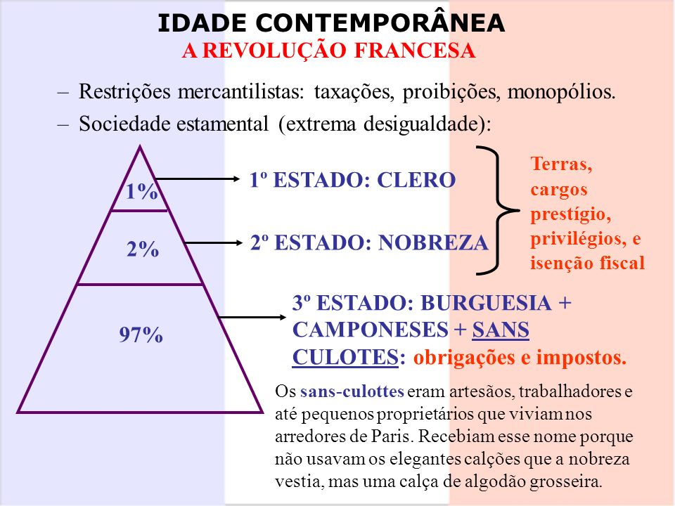

# A Revolução Francesa

# Escola: Gildo Veríssimo 
# Disciplina: Português 
# Professor: Marcos
# Turma: 8° ano B
# Aluna: Ketilly Maria
# Data: 21/09/22
---

# __A REVOLUÇÃO FRANCESA__
---

## •INTRODUÇAO:

---

→Foi o conjunto de eventos que, de 1789 a 1799, alterou o quadro político, econômico e social da França.

→Antes da revolução, a França era caracterizada pelo __Antigo Regime,__ ou seja, o absolutismo monárquico, o mercantilismo e a sociedade estamental.

→A revolução rompeu com o antigo regime, que dominava a Europa desde o século XV. Tornou-se, assim, portanto Marco histórico, indicando a __Idade Contemporânea.__

→A Revolução Francesa inspirou reformas em outros países, além de ter influenciado na __Independência das colônias__ _espanholas_ e na _proclamação da independência do Brasil._

→Embora seja uma revolução burguesa, houve forte participação popular;

→Representa o momento em a burguesia, já detentora do poder econômico, atinge o  PODER POLÍTICO.

 

---

## •CAUSAS:

---

→Dentre as principais causas da Revolução Francesa, podemos destacar o __custo da monarquia,__ pois o rei Luís XVI e a sua corte __gostavam enormes quantias__ para sustentar seus privilégios.

→As __ideias iluministas__ também influenciaram o desejo por reformas políticas e econômicas. Os ideais e liberdade, igualdade entre fraternidade acabaram estampados na cores da bandeira e também no hino da França.

→O __gasto com guerras__ pesou no economia do poís. A França participou da Guerra da __Independência dos Estados Unidos__ e perdeu a __Guerra dos Sete Anos__, contra a Inglaterra.

→Politicamente, o reinado de Luís XVI caracterizava uma monarquia absolutista (poder ilimitado e de origem divina).

→Além disso, o __quadro econômico na França era péssimo__ e a fome ameaçava a população. Secas prejudicavam a agricultura e acentuavam a miséria. Havia escassez de alimentos, o que aumentava ainda mais a revolta da população.

→A __divisão da sociedade francesa__ também pode ser considerada causa da revolução, pois não havia mobilidade e a posição social dependia do nascimento.

---

__sociedade estamental;__

---

A sociedade estamental é caracterizada por ser uma sociedade em que o nascimento é determinado para a atribuição do status social. O status social é reativo ao estamento, ao segmento da sociedade, em que a pessoa nasce, portanto,  a mobilidade social é bastante baixa nesse modelo de sociedade.

