# CADERNO DE VIAGEM & GASTRONOMIA

# Escola: Gildo Veríssimo 
# Disciplina: Português 
# Professor: Marcos
# Turma: 8° B
# Aluna: Ketilly Maria 
# Data: 23/09/22


                                                                             
                                                                             |1|
                                                                             

---


# __Patagônia chilena: a força da natureza em Torres del Paine__

---


Lugar único na Terra, parque na Patagônia nos presenteia com visuais que parecem ter saído da ficção; montanhas, icebergs e geleiras garantem paisagens e atividades que despertam nosso lado aventureiro


---


## A Patagônia


---


 


A Patagônia é uma região geográfica que abrange a Argentina e o Chile. Do lado chileno encontramos regiões arborizadas e cadeias de montanhas caracterizadas por picos cobertos de gelo, além de lagos com tons azulados e geleiras.

Em resumo, é uma região repleta de paisagens cinematográficas e cenários intocados pelo homem, um antro para quem ama atividades ao ar livre, ecoturismo e pitadas de aventura.

Não são somente estas pessoas, porém, que são contempladas por aqui: o bacana é que a Patagônia tem uma série de expedições que podem ser feitas de várias maneiras. A beleza deste pedaço do Chile reside no fato de obedecermos a contemplação da natureza.

Caminhadas longas podem ser feitas, mas há certos trajetos, por exemplo, que podem ser acessíveis de carro. Os passeios são adaptáveis.

Inclusive, se quisermos um dia mais relaxante, uma opção é tomar vinho no hotel enquanto apreciamos a paisagem – ou seja, são várias as possibilidades.

Uma das maneiras mais populares de chegarmos à Patagônia chilena é via Santiago, com voos que ligam a capital até Punta Arenas, cidade próxima da extremidade da região mais sul do país.

Vários são os parques que fazem parte da Patagônia chilena, mas o maior e mais conhecido – e também imperdível – é o Torres del Paine.


---


## Parque Nacional Torres del Paine


---


Uma das maiores e mais importantes portas de entrada para se ter um gosto verdadeiro da Patagônia chilena é o Parque Nacional Torres del Paine. Criado em 1959, o parque fica na região de Magalhães e ocupa cerca de 230 mil hectares de área.

Paisagens que parecem ter saído de um filme de ficção nos deixam para lá de encantados. Florestas, colinas, quedas d’água, lagos glaciares, vistas privilegiadas para picos nevados e campos de gelo: aqui, ficamos maravilhados com tudo isso e muito mais.

É de longe um dos lugares mais lindos da América do Sul, acessível a cerca de 112 km da cidade de Puerto Natales. E deixo avisado que, mesmo no caminho, não há como não parar o carro e contemplar as paisagens em volta: esse já é um passeio e tanto.

Além das paisagens fascinantes e atividades que nos conectam com o ambiente natural, há também toda uma história geológica por trás do parque e da Patagônia que podemos conferir de perto com nossos próprios sentidos.


---


## Lodge Explora e informações básicas


---


O Torres del Paine conta com centro de visitantes, área para camping e também lodges e hotéis. Um deles é o Explora, que foi uma das aconchegantes bases dentro do parque nacional durante as gravações do programa.

Com apenas 49 quartos, a impressão é de estarmos num hotel mais íntimo, construído com madeiras e integrado à paisagem ao redor – a arquitetura foi pensada de forma a interferir o menos possível com o entorno.

Erguido há mais de duas décadas, o hotel, inserido nesta localização única, possui janelas que enquadram perfeitamente as vistas para as margens do Lago Pehoé e para o Maciço del Paine.

Se as vistas já nos deixam relaxados, o spa com massagens, piscina coberta e climatizada junto à sauna, ou ainda as jacuzzis com vista para o Rio Paine, nos ajuda na tarefa de ficarmos ainda mais despreocupados.

Vinhos de rótulos chilenos, entre brancos, tintos e rosés, são servidos nas mesas do restaurante junto de pratos bem elaborados com ingredientes locais.
A partir do hotel são mais de 40 expedições que podemos fazer nesta área protegida, onde caminhamos, pisamos na terra, fazemos trilha ou ainda percorremos trajetos a bordo de veículos para pontos mais distantes e subimos numa embarcação em meio às geleiras.

O dia a dia no Explora é assim: acordamos bem cedo, nos encontramos com o guia, juntamos com o grupo e comparecemos ao briefing do passeio do dia.

O parque também é dividido em dois principais circuitos, chamados de “W” e de “O”, os quais abrangem trekking nos principais pontos que podem levar até alguns dias para serem percorridos inteiramente.

Vale ressaltar que não há sinal de internet ou telefone nas trilhas internas do parque, portanto, é uma boa oportunidade de ficarmos, inevitavelmente, desconectados por vários dias.

E tudo isso com uma sensação térmica de muitos graus abaixo do que aponta o termômetro: rajadas fortes e geladas de vento são onipresentes, chegando normalmente até os 40 km/h. Por isso, esteja muito bem agasalhada.

A própria administração do parque alerta que o clima na Patagônia muda rapidamente. Portanto, camadas de roupas apropriadas para resistir à chuva, vento e neve são importantes.

Fora os lembretes acima, o parque também cobra uma taxa e possui horários específicos de entrada. É sempre bom checar os preços, que variam de US$ 35 a US$ 49, e os horários no site oficial.


---


## Pontos principais imperdíveis


---


Estar no Parque Nacional Torres del Paine é notar que o clima altera a todo momento e que as paisagens mudam a cada hora, ora com a incidência dos raios solares, ora com sombras, ora com cores de águas diferentes. É uma dança da natureza imperdível.


As principais atividades que podemos experimentar por aqui envolvem hikes, montanhas, cavalgadas, passeio de barco pelo glaciar Grey e passeios autoguiados, passando por lagos, lagunas, cachoeiras, vales e miradouros.

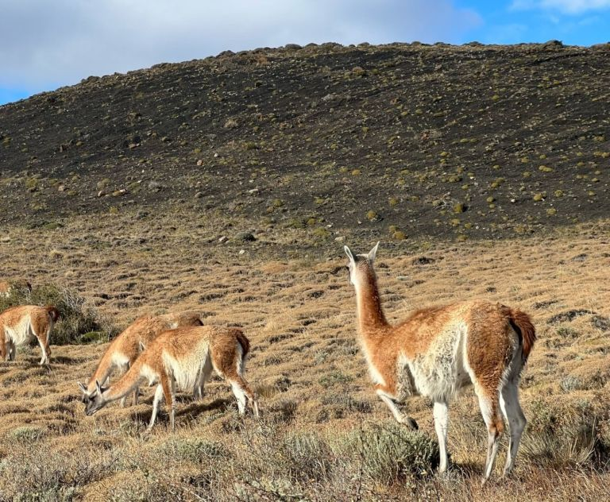 


A fauna também dá as caras pelo parque e nos deparamos com diversas espécies ao longo dos trajetos. Em algumas trilhas ficamos bem perto de vários guanacos, mamíferos ruminantes nativos da América do Sul. Interessante é que o parque concentra também um elevado número de pumas, aproximadamente 100.

Caso nos encontremos com um puma, a administração do parque aconselha manter a calma e não se aproximar dos animais. A recomendação é: “Não corra e se afaste lentamente olhando-o nos olhos. Fique de pé, tente parecer maior, faça barulhos altos”.

--- 


Lago Sarmiento


---


A começar, depois de já estabelecida no hotel, o Lago Sarmiento foi uma boa pedida para iniciar a aventura pelo parque. Com um trekking de média dificuldade, chegamos à beirada do lago, que recebe o nome do explorador espanhol Pedro Sarmiento de Gamboa.

De longe, notamos que algumas bordas do lago se assemelham com pequenas praias. Aqui, porém, além de visuais incríveis, nos deparamos com milhares de anos de geologia na caminhada pelas bordas, as quais são o lar de formações chamadas de trombolitos.

Estas formações nos remetem aos primórdios do planeta e são o resultado do depósito de cálcio e atividade de microorganismos dos mais antigos da Terra. Mais especificamente, os trombolitos são o resultado da fotossíntese que as cianobactérias fazem no lago.

Poucos são os lugares no mundo onde trombolitos são encontrados e, no Lago Sarmiento, temos a oportunidade de ver uma parte da história da Terra diante de nossos olhos e pés. É para lá de especial.


---


Lago Pehoé, Maciço del Paine e Mirantes


---


Próximo do hotel Explora fica o Lago Pehoé, que concentra uma alta quantidade de minerais. Suas águas cristalinas ficam de um azul brilhante em determinados momentos do dia e somos agraciados com uma incomparável beleza paisagística com o Maciço del Paine ao fundo.

Daqui também conseguimos avistar os Los Cuernos del Paine, os “chifres”, título dado ao conjunto de picos de granito pontiagudos que se erguem a mais de 2 mil metros de altura.

O bacana é andar nas beiradas do lago, onde, literalmente, não encontramos mais ninguém: somos nós e a natureza, nada mais.

Torres del Paine também dispõe de cerca de seis mirantes em sua área. Podemos percorrer estes miradouros de carro, em que, como de costume, encontramos cenários deslumbrantes, que nos fornecem ângulos diferenciados para o Maciço Paine.


---


Passeio de barco pelo Glaciar Grey


---


Percorrer o Glaciar Grey é um dos programas mais fantásticos que podemos fazer no parque nacional. É uma experiência que fica em nossas lembranças para sempre, daquelas atividades que temos que fazer uma vez na vida.

O Lago Grey, com mais de 500 metros de profundidade, leva o nome do Glaciar Grey, a terceira maior extensão de gelo continental do mundo, perdendo apenas para Antártica e Groelândia – lembrando que 80% das geleiras da América do Sul ficam no Chile.

O Parque Nacional Torres del Paine abrange só uma parte do glaciar, mas que já é magnífico em todos os detalhes.

Uma das maneiras mais práticas de percorrer o lago e admirar as formações de gelo de azul-intenso é navegando por suas águas. Para chegarmos até o barco – agendado à parte com o agências de turismo ou mesmo o Hotel Explora – precisamos caminhar por uma praia de pedrinhas soltas.

O passeio dura por volta de três horas e nos permite chegar bem perto das geleiras. Vamos notando vários icebergs no caminho, os quais foram se desprendendo do Glaciar Grey.

A cor azul intensa da geleira é o que mais salta aos nossos olhos. É esplêndido.

Por outro lado, temos que nos agasalhar de maneira reforçada. Os fortes ventos que experimentamos no lado externo do barco são cortantes, ainda mais quando chegamos mais perto do glaciar.

Em determinado momento, a tripulação pesca alguns pedaços de gelo do lago. O propósito? Fazer um drinque usando o gelo que vem do glaciar. É uma experiência, no mínimo, divertida.

Segundo a tripulação, o gelo para nossos drinques datava de cerca de oito mil anos – quanto mais transparente, mais antigo o gelo é. O brinde é feito com pisco sour ou com drinque não alcoólico bem ao estilo patagônico.

Além da navegação, os mais aventureiros podem ainda encontrar algumas trilhas do parque que desembocam no lago, como os circuitos “W” e “O”.


---


Lago Nordenskjold


---


A partir do hotel Explora, a trilha até o Lago Nordenskjold é de seis quilômetros. O lago, que possui belas cores, fica próximo dos Cuernos del Paine, os chifres de Torres del Paine, que são um dos símbolos do parque.

Novamente, o vento é intenso e chega a nos carregar. No trajeto há até placas com sinalização da velocidade dos ventos do dia e algumas recomendações: somos aconselhados a não realizar atividades se a ventania passar de 80 km/h.

Com paisagens surreais lindíssimas, que nos arrancam um “uau”, o caminho também nos lembra de um passado triste: entre 2011 e 2012 um incêndio florestal, com suspeitas de ter decorrido da ação humana, devastou mais de 17 mil hectares florestais do parque.

Em alguns trechos do trajeto ainda podemos ver resquícios do incêndio.

Apesar da trilha nos exigir certo esforço, somos recompensados ao chegarmos até as redondezas do lago. Aqui nos surpreendemos com pouco, que já é muito: com a vista, com a natureza e com as paisagens de cinema.

As cores da água são maravilhosas e os fundos são surreais. Inevitavelmente ficamos em silêncio contemplando esta beleza natural. Às vezes, ouvimos barulhos que parecem trovões, mas que, na verdade, são movimentações repentinas da neve.

O café quente da garrafa térmica ajuda a aquecer o corpo, já que as vista aquecem a alma.

Após a caminhada, lembramos que, em certas ocasiões, ficamos mais preocupados com o caminho do que com o presente: o trajeto é uma boa lembrança de que precisamos nos permitir a ver o diferente e sair da zona de conforto. Vale a pena.


                                                                             |2|
                                      


---


# __Disney anuncia lançamento de 6º navio de sua frota e novidade em ilha nas Bahamas__


---


O Disney Treasure será inspirado nas aventuras de Aladdin; empresa também divulgou cruzeiros "para lugar nenhum”, em que o navio é o próprio destino

 


Um novo gigante dos mares será lançado nas águas em 2024: na semana passada, a Disney anunciou a inauguração do sexto navio de sua frota, o Disney Treasure, que terá o hall principal inspirado em “Aladdin”.

De acordo com a empresa, o inédito navio será inteiramente decorado pelo tema da aventura, inspiração vinda do amor de Walt Disney por novas descobertas.


“Inspirado pela grandeza e mistério de um palácio dourado, o Grand Hall se baseia em influências do mundo real da Ásia e da África e presta homenagem à terra distante de Agrabah, do conto de Aladdin”, compartilhou a companhia.

Uma estátua do personagem junto de Jasmine e do Tapete Mágico ficará disposta no átrio principal – uma tradição dos navios da Disney.


 

```Projeto mostra como será o átrio do Disney Treasure, com detalhe da estátua de Aladdin ao lado da escada / Divulgação```


O Disney Treasure é a segunda das três embarcações planejadas pela empresa até 2025. Neste ano, o Disney Wish fez suas primeiras viagens com passageiros pelo Caribe, no mês de julho.

Assim como o Disney Wish, é esperado que o Disney Treasure tenha cerca de 1.254 cabines.


---


## Novidades nas Bahamas


---


 

```Arte conceitual mostra como será o novo destino da Disney nas Bahamas, o Lighthouse Point, na ilha de Eleuthera / Divulgação```


Além da inédita embarcação, outras novidades foram divulgadas durante a D23 Expo 2022, evento oficial da The Walt Disney Company, realizado no centro de convenções em frente aos parques da Disney na Califórnia, e que contou ainda com palestras, presença de artistas e painéis.

Entre elas, os detalhes sobre o segundo destino de ilha da Disney nas Bahamas: o Lighthouse Point, localizado na ilha de Eleuthera, foi escolhido como novo ponto de parada da companhia.

Além das praias de areias brancas e águas azul-turquesa, são previstos centros de entretenimento, de compras, locais para refeições e um playground aquático, assim como um pavilhão cultural dedicado a histórias e tradições locais.

“Será um vibrante retiro de praia com a cor e a energia das Bahamas”, disse a Disney em comunicado.

A companhia ainda afirmou que 90% da energia será solar e que empregará práticas de construção sustentável.


---


## Cruzeiros na Austrália e Nova Zelândia


---


As primeiras viagens da empresa partindo da Austrália e da Nova Zelândia também foram anunciadas.

De outubro de 2023 a fevereiro de 2024, o navio Disney Wonder partirá de Sydney, Melbourne e Brisbane, na Austrália, assim como de Auckland, na Nova Zelândia, como parte de uma série de itinerários batizada de “Disney Magic at Sea”.

Os cruzeiros são “para lugar nenhum” e o navio é o próprio destino – a programação a bordo mergulhará os hóspedes nos universos da Pixar, da Marvel e de Star Wars.

As viagens de reposicionamento entre Honolulu, no Havaí, e Sydney, na Austrália, passarão ainda por Fiji e Samoa, destinos insulares no Pacífico Sul. As reservas abrem no próximo dia 6 de outubro.


                                                                            |3|


---


# __4 chefs brasileiros estão entre os 100 melhores do mundo; Alex Atala fica em 10º__


---


Acabam de ser divulgados os vencedores da sexta edição do The Best Chef Awards; espanhol Dabiz Muñoz, do restaurante DiverXo, é o melhor pelo 2º ano consecutivo


 

```Final do The Best Chef Awards, premiação que destaca os melhores chefs do mundo Edward Trzeciakiewicz```


A sexta edição do The Best Chef Awards, premiação que destaca os melhores chefs do mundo e realizada desde 2017, elegeu na noite dessa terça-feira (20), o madrilenho Dabiz Muñoz como o melhor chef do mundo.

No comando do DiverXo, restaurante com três estrelas Michelin na capital espanhola que aposta numa cozinha criativa e de vanguarda, o jovem chef já havia sido coroado como o nº 1 do mundo na edição passada. Desde o primeiro ano da premiação, o profissional espanhol nunca saiu do top 10.


Antes de abrir a própria casa, Muñoz ganhou experiência em Madrid e também em Londres, onde chegou a trabalhar no Nobu.

Segundo as considerações do The Best Chef Awards, ele “construiu uma reputação como um aventureiro pioneiro e criativo. Ainda na casa dos trinta anos, o chef surpreende continuamente com a sua abordagem única à cozinha”.


 

```O madrilenho Dabiz Muñoz é o melhor chef do mundo em 2022 / Edward Trzeciakiewicz```


---


## Brasileiros entre os 100 melhores


---


Além dele, o ranking com os 100 melhores chefs do mundo em 2022 também foi divulgado e quatro nomes brasileiros aparecem entre as escolhas.

Alex Atala, do D.O.M, em São Paulo, ficou na 10ª posição – o chef já chegou a figurar na quarta colocação do prêmio em 2017.

Na edição atual, Alberto Landgraf, que comanda o Oteque, no Rio de Janeiro, apareceu no 46º lugar.

Logo em seguida vem Manu Buffara, do restaurante Manu, em Curitiba, na 48ª colocação. Vale ressaltar que, também nesta terça-feira (20), a chef paranaense foi eleita a melhor chef mulher da América Latina pelo ranking Latin America’s 50 Best Restaurants.


 

```Alex Atala durante a 6ª edição do The Best Chef Awards em Madri, Espanha/ Divulgação```


Por fim, *Helena Rizzo*, que lidera o restaurante Maní, também na capital paulista, figurou na 100ª posição.


Além dos brasileiros, outros nove nomes da América do Sul também entraram para a lista. São eles: Virgilio Martínez, do Peru (15º lugar); Mauro Colagreco, da Argentina (22º); Rodolfo Guzman, do Chile (27º); Pía León, do Peru (50º); Augustin Balbi, da Argentina (61º); Leonor Espinosa, da Colômbia (69º); Paulo Airaudo, da Argentina (85º); Alvaro Clavijo, da Colômbia (86º) e Jaime Pesaque, do Peru (95º).


Confira o ranking completo no site oficial.


O ranking dos melhores chefs do mundo é feito com base em uma lista prévia de 200 nomes, a qual contém um mix entre 100 chefs novatos e os 100 chefs considerados os melhores do mundo na edição passada.

A lista final é criada com base nos votos secretos dos atuais top 100 chefs, dos outros 100 candidatos e também com base nas escolhas de 150 profissionais ligados ao ramo gastronômico, como jornalistas, críticos e fotógrafos.

Os votos de maior peso são dos chefs, que representam 70% do resultado final, em que, segundo a premiação, é uma maneira de “homenagear seus pares”. Os chefs, porém, não podem votar neles mesmos.

A votação ocorre por pesquisa on-line, onde os membros recebem um link exclusivo com todo o processo. Cada pessoa pode votar em 10 chefs e o sistema de pontos é de 10 a 100. A votação se inicia em maio e os participantes possuem um mês para fazer suas escolhas.

A sexta edição da premiação foi sediada em Madrid e contou também com painéis e demonstrações gastronômicas entre os dias 18 e 20 de setembro.


                                                                             |4|
---


# __As melhores companhias aéreas do mundo em 2022, segundo Skytrax__


---


Pesquisa de site de avaliação de companhias aéreas e aeroportos com sede no Reino Unido conversou com mais de 14 milhões de clientes em mais de 100 países


 

```Skytrax World Airline Awards 2022 escolhe Qatar Airways como a melhor do mundo Divulgação```


Da Covid-19 ao caos, 2022 foi outro ano turbulento para a indústria da aviação. Em grande parte no hemisfério norte, a movimentada temporada de verão foi marcada por atrasos e cancelamentos, enquanto nos Estados Unidos um novo estudo nesta semana descobriu que a satisfação dos passageiros de aviões está diminuindo em todos os setores.

Ainda assim, à medida que avançamos nos meses de viagem mais calmos de setembro e outubro, houve motivo de comemoração em Londres nesta sexta-feira (24), quando os líderes do setor se reuniram no Langham Hotel para o Skytrax World Airline Awards 2022 – a primeira vez que o evento foi realizado presencialmente desde 2019.

A Skytrax, um site de classificação de companhias aéreas e aeroportos com sede no Reino Unido, realizou mais de 14 milhões de pesquisas com clientes em mais de 100 países entre setembro de 2021 e agosto de 2022 para descobrir a atual companhia aérea favorita do mundo.

O vencedor deste ano não era estranho ao pódio. A recém-coroada Qatar Airways ganhou o prêmio principal um total de sete vezes desde que os prêmios foram introduzidos em 1999.

A companhia de bandeira do Catar também conquistou mais oito prêmios, incluindo Melhor Classe Executiva, Melhor Assento de Classe Executiva e Melhor Classe Executiva Sala de jantar. Isso vai ser muito para trazer de volta na bagagem de mão.


Há apenas dois meses, a companhia aérea ficou em primeiro lugar no ranking da *AirlineRatings.com* das melhores companhias aéreas do mundo.

O executivo-chefe do grupo da *Qatar Airways*, Akbar Al Baker, agradeceu a seus “funcionários incríveis” por “sua dedicação e motivação contínuas” e disse que “ganhar esses prêmios no mesmo ano em que comemoramos nosso 25º aniversário é ainda mais gratificante”.

Pouco depois de receber o prêmio, ele disse à *CNN Travel* que o segredo do sucesso sustentado da companhia aérea era: “Serviço consistente, produto consistente, atenção consistente aos passageiros e dedicação absoluta de todos que trabalham na companhia aérea”.

A Singapore Airlines, a nova cia número 2 do mundo de acordo com a pesquisa da Skytrax, também ganhou nove prêmios, incluindo Melhor Pessoal de Cabine, Melhor Primeira Classe, Melhor Assento de Primeira Classe e Melhor Catering de Primeira Classe.


---


## A surpresa da Ryanair


---


A Emirates, transportadora de bandeira dos Emirados Árabes Unidos, ficou em terceiro lugar e também foi premiada como Melhor Entretenimento a Bordo, Melhor Classe Econômica, Melhor Catering na Classe Econômica e Melhor Assento na Classe Econômica Premium.

A ANA do Japão (All Nippon Airways) ficou em 4º lugar e também foi nomeada a companhia aérea mais limpa do mundo: nada fácil quando dois anos de *Covid-19* significaram que os clientes estão particularmente atentos aos padrões de higiene e limpeza. Além disso, ganhou mais quatro prêmios, incluindo Melhores Serviços Aeroportuários.

A companhia aérea australiana Qantas ficou em quinto lugar na pesquisa com mais de 350 companhias aéreas, realizada nos idiomas inglês, francês, espanhol, russo, japonês e chinês.


A Delta Air Lines foi a companhia aérea líder nos EUA, vencendo seis categorias de prêmios específicos para cada região, enquanto a Turkish Airlines foi a principal companhia aérea da Europa, levando para casa quatro prêmios, incluindo o altamente competitivo título de Melhor Companhia Aérea na Europa.

Em uma das maiores mudanças do dia, a companhia aérea irlandesa Ryanair – que nunca teve medo de provocar polêmica em seus 37 anos de história – triunfou nos prêmios pela primeira vez, conquistando a coroa de Melhor Companhia Aérea de Baixo Custo na Europa.

Esse sucesso com os clientes deve-se em grande parte ao fato de ter emergido neste verão como uma das companhias aéreas mais confiáveis ​​da região, cancelando relativamente poucos voos e até oferecendo voos de “resgate” em julho e agosto para ajudar pessoas retidas por cancelamentos de seus concorrentes.

Albertine Murasira, comissária de bordo da RwandAir, que ganhou o melhor serviço de equipe aérea na África, disse que o prêmio incentivaria a transportadora a elevar ainda mais os padrões.

Como é um prêmio para “melhores funcionários, esta é uma vitória muito grande para nós”, disse ela à CNN. “Isso vai nos encorajar a continuar cuidando de nossos passageiros”.

Edward Plaisted, CEO da Skytrax, disse que, embora os prêmios celebrassem o melhor da aviação, a indústria ainda estava enfrentando a tensão do Covid, a escassez de pessoal e os aumentos nos preços dos combustíveis causados ​​pelo conflito na Ucrânia.

“Em suma, não foram os momentos mais felizes em muitos aspectos”, disse ele à plateia da cerimônia.

As companhias aéreas não pagam nenhuma taxa de inscrição ou inscrição para se qualificar para os prêmios e todos os custos da pesquisa e do evento de premiação são pagos pela Skytrax. Para obter a lista completa de vencedores, visite o site da Skytrax.


---


## As 20 maiores companhias aéreas do mundo em 2022, segundo a Skytrax:


---


1. Qatar Airways
2. Singapore Airlines
3. Emirates
4. ANA (All Nippon Airways)
5. Qantas Airways
6. Japan Airlines
7. Turkish Airlines
8. Air France
9. Korean Air
10. Swiss International Air Lines
11. British Airways
12. Etihad Airways
13. China Southern Airlines
14. Hainan Airlines
15. Lufthansa
16. Cathay Pacific
17. KLM
18. EVA Air
19. Virgin Atlantic
20. Vistara


                                                                             |5|
---


# __Dia do Sorvete: lugares que oferecem sabores nada convencionais em São Paulo__


---


Cenoura roxa com laranja e mamão, morango com vinagre balsâmico, framboesa com água de rosa. Permita-se conhecer diferentes gostos e apaixone-se ainda mais por essa sobremesa gelada


 

```Vitrine da Albero dei Gelati Bruno Geraldi```


Tudo começou há 4.000 anos na China. Depois, cruzou oceanos, aterrissou na Itália, na França, até conquistar o mundo todo, inclusive o Brasil. Falamos do sorvete, sobremesa gelada, versátil e saborosa, que tem um dia só dela: 23 de setembro.

É, sim, paixão nacional parte porque nosso clima tropical, com altas temperaturas, favorece doces refrescantes, e parte porque nosso toque “abrasileirado” fez nascer sabores autênticos e preparos sem igual.

O levantamento realizado pela MindMiners, que ouviu mais de mil homens e mulheres acima de 16 anos, das classes ABC de todo o Brasil, entre os meses de março e abril desse ano, identificou que 74% gostam de sorvete como sobremesa após as refeições e 62% dos entrevistados quando saem com amigos e familiares. Como snack, o sorvete foi lembrado por 53% dos entrevistados que revelaram tomar sorvete vendo TV ou canais de streaming e 40% em lanches entre as refeições. Ou seja, para os brasileiros qualquer hora é hora de sorvete!


Para celebrar esse dia tão saboroso, selecionamos sorveterias que oferecem com primor sabores tradicionais, claro, mas que sabem inovar e mostram que um belo gelato vai muito além do chocolate e creme. Conheça uma a uma e faça uma verdadeira viagem por sabores “diferentões”.


---


## Pinguina Sorveteria


---


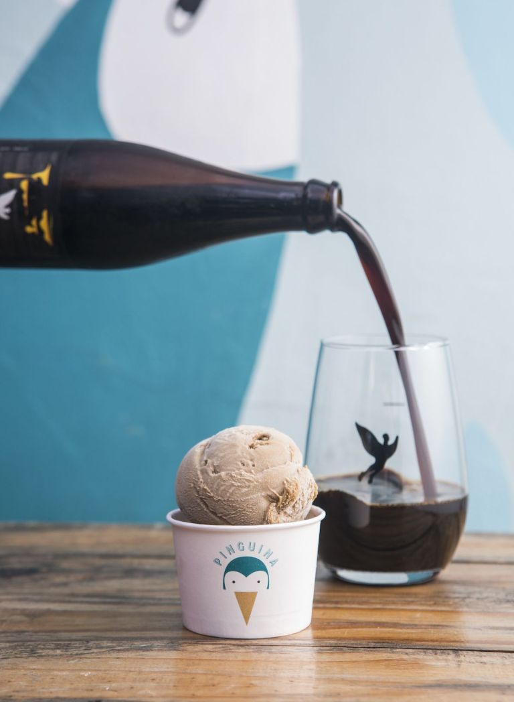 

```Pinguina lança sorvete em parceria com a cerveja Trilha / Rjcastilho```


A pequena e convidativa casinha na Vila Madalena, perto do Beco do Batman, é endereço certeiro para amantes de sorvetes artesanais produzidos numa máquina italiana de 1968, que foi restaurada pelos sócios. Não usam corantes, saborizantes e bases prontas, além de terem os sabores brasileiros como grandes estrelas do menu. Sem químicos e com sabor natural, permita-se experimentar o de cumaru, de cupuaçu, de seriguela, de baunilha com lavanda e lançam hoje, no Dia do Sorvete, um gelato em parceria com cerveja nacional TRILHA. O sorvete feito com a Pão de Mel, cerveja inspirada no doce e uma das mais queridas pelo público da cervejaria artesanal.

_Pinguina Sorveteria: Rua Medeiros de Albuquerque, 337 – Vl. Madalena – São Paulo – SP / Funcionamento: de terça a sábado das 12h às 19h e domingo e feriado das 12h às 18h / Delivery via iFood._


---


## Gelato Boutique


---

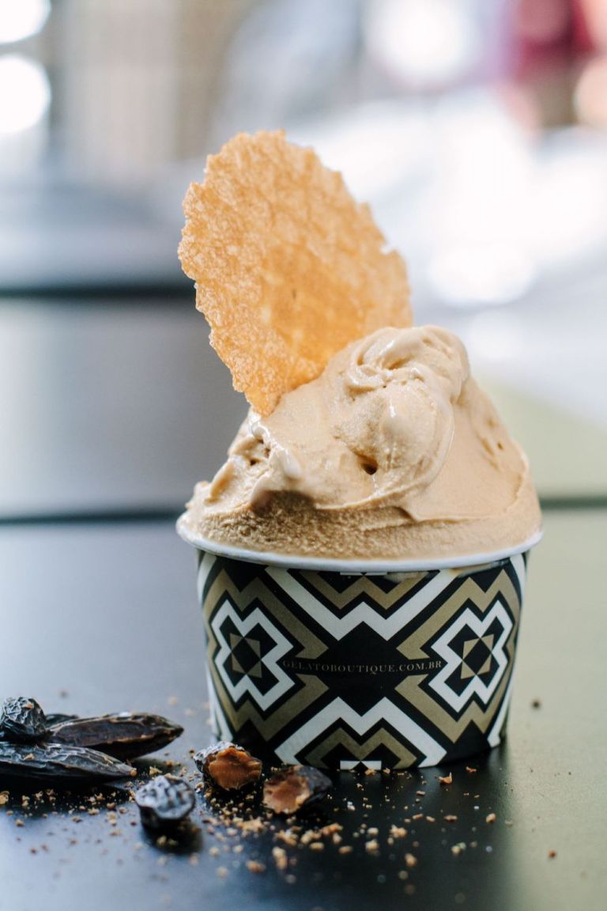 

```Doce de leite com cumaru da Gelato Boutique, a sorveteria mais premiada do Brasil / Roberto Seba```


A Gelato Boutique é comandada pelas hábeis mãos da premiada chef gelatière Marcia Garbin e é um verdadeiro centro cultural do gelato. Suas criações são reconhecidas por diversas premiações nacionais e internacionais. Os sorvetes são preparados à base de água, leite de búfala, leite de cabra, leite de ovelha e leite bovino tipo A2. O leite possui apenas a proteína beta caseína A2 e como esta proteína também é encontrada no leite materno, ela é de fácil digestão pelo organismo e seguro para pessoas que possuem alergia à proteína do leite.

O cardápio é autêntico e moderno, e o sabor carro-chefe da casa, o premiado “Caffé-Lime”, é preparado com um blend feito pela Café Martins exclusivamente para a Gelato Boutique e composto por duas variedades de café arábica: o Catuí vermelho e o Catuí amarelo que passam por uma leve fermentação deixando a bebida com agradável acidez láctica e finalização doce como caramelo e castanhas. Entre outros sabores que se destacam estão o doce de leite com cumaru (semente amazônica); macadâmia caramelizada; caramelo de shoyu com base de creme com shoyu caramelizado; e pistache feito com sementes de pequenos produtores. Os gelatos são servidos em casquinhas artesanais preparadas com um toque de Cumaru.

_Gelato Boutique: Rua Pamplona, 1023, Jardins – São Paulo – SP /  Tel.: (11) 3541-1532 (também Whatsapp) / Funcionamento: todos os dias, das 11h às 20h / Rua dos Pinheiros, 444, Pinheiros / Funcionamento: todos os dias, das 12h às 22h / Av. Paulista, 1230 – Shopping Cidade São Paulo (4 andar) – São Paulo – SP / Funcionamento: todos os dias, das 11h às 22h / Delivery via Rappi, iFood ou próprio._


---


## Frida&Mina


---


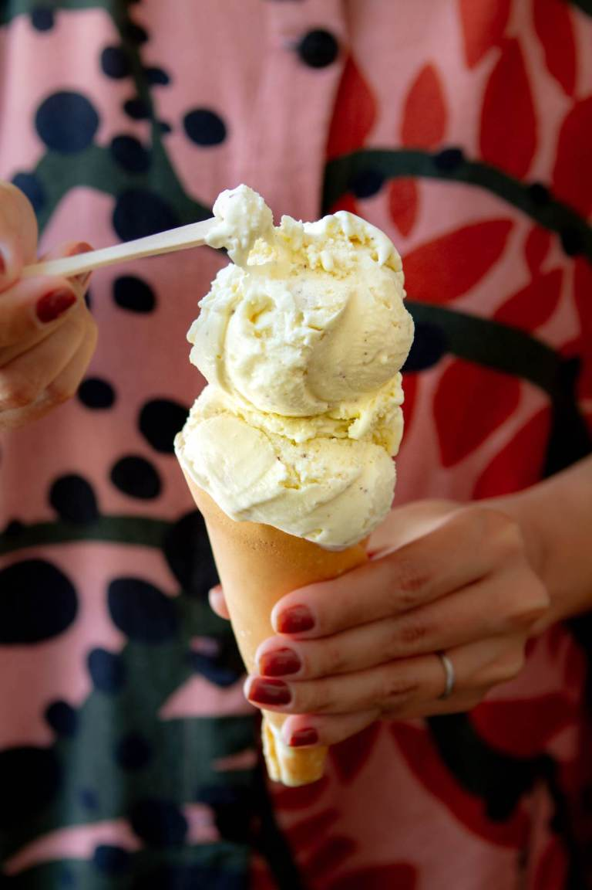 

```Frida & Mina oferece sorvetes artesanais e vasto menu de sabores, como o de batida de coco da Frida & Mina / Roberto Seba```


Usando ingredientes naturais, orgânicos sempre que possível e de produtores locais, a sorveteria serve bolas de sorvete artesanal na casquinha caseira e café coado, o que deixa um aroma no ambiente incrível e atrai passantes que fazem fila na porta. Na Frida & Mina, os gelatos não contêm estabilizantes ou corantes e, atualmente, há cerca de 30 opções de sabores. Entre elas, 10 são fixas e as outras variam semanalmente, de acordo com a sazonalidade. No total, há sempre 16 sabores na vitrine, como o de café, que é feito com grãos de arábica Martins Café, e o de hortelã, que leva muita hortelã fresca e flocos de chocolate Amma 45%. Creme de limão, gengibre com mel, cachaça com mel e limão, caramelo com flor de sal e morango com vinagre balsâmico também estão no cardápio e valem ser provados.

_Frida&Mina: Rua Artur de Azevedo, 1147, Pinheiros / Funcionamento: segunda a sexta, das 12h às 22h, e sábado, domingo e feriados, das 11h às 22h / Delivery via Rappi_


---


## Albero dei Gelati 


---


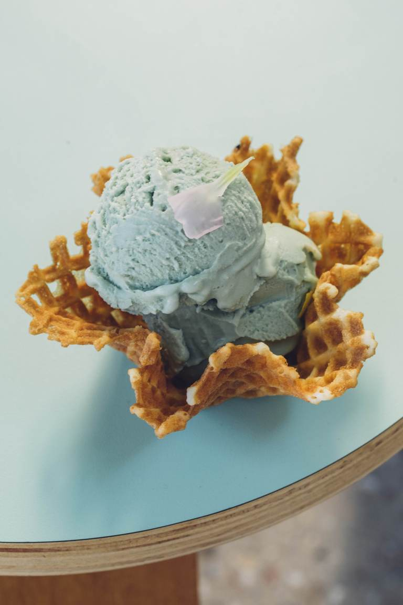 

```Sucesso na Itália e em NY, Albero dei Gelati oferece no Jardins sabores como alga orgânica com infusão de flores, cebola e pimenta / Bruno Geraldi```

Criada em 1985 na Itália e com unidade em Nova Iorque, a Albero dei Gelati entende que o coração do seu gelato reside na terra, no agricultor e na relação que estabelecem com ele. O primeiro passo quando abriram em São Paulo, em 2019, foi fazer uma série de viagens Brasil afora para garimpar ingredientes e pequenos produtores que partilhassem dos seus valores. Os ingredientes selecionados são, em sua maioria, locais e sazonais, e, sempre que possível, orgânicos e biodinâmicos.

O resultado dessa visão e desta busca é o que chamam de “gelato agrícola”; um produto artesanal que nasce da terra, natural, sem nenhum aditivo químico, saboroso e consciente em relação ao meio ambiente. As opções de sabores sempre mudam, mas combinações inusitadas como Spirulina (alga orgânica) com infusão de flores (como capuchinha, lavanda, gerânio e camomila) e base de leite; Cenoura Roxa com laranja e mamão; Tisamissu com Amora; Queijo da Serra da Canastra com castanha e mel; Pimenta; e Cebola vira e mexe aparecem no menu.

_Albero dei Gelati: Al. Tietê, 198, Jardins  e Rua Joaquim Antunes, 391, Pinheiros – São Paulo-SP / Tel.: (11) 3062-2436 e (11) 3063-1821 / Funcionamento: todos os dias, das 10h às 23h / Delivery via Rappi e iFood_


---


## San Lorenzo Gelateria


---


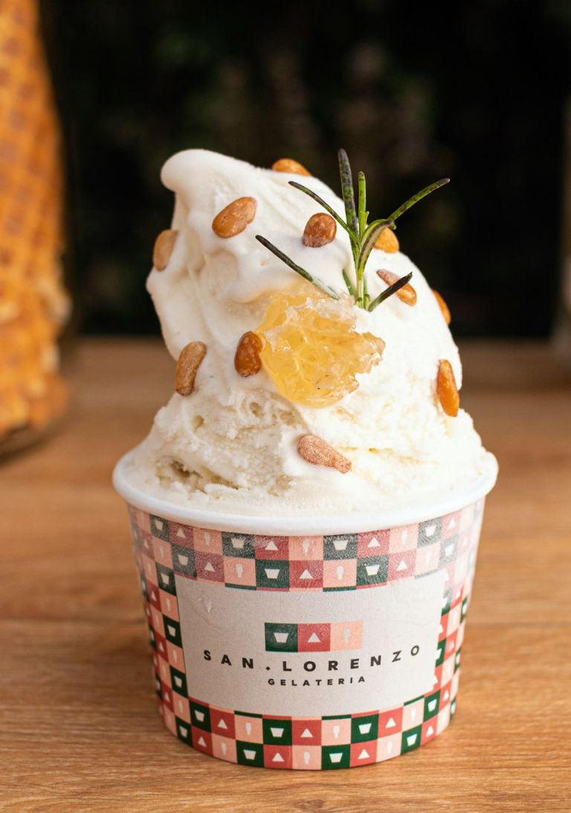 

```San Lorenzo Gelateria ficou entre as melhores sorveterias do mundo em importante competição na Itália / Divulgação```


O Brasil está entre as 50 melhores gelaterias do mundo, de acordo com a última edição do Festival Mundial do Gelato, que aconteceu em Roma, na Itália. E a brasileira San Lorenzo Gelateria surge no 37º lugar. 

Comandada pelo chef Brenno Floriano, o sabor que dá nome à casa é uma delicada combinação de ricota, mel com alecrim e pinolis, por exemplo. Com mais de 60 sabores no menu, tem dos clássicos como pistache, chocolate e baunilha, aos mais criativos e surpreendentes, como gorgonzola, strudel e mascarpone com figo e hibisco.

_San Lorenzo Gelateria: Av. Jorge João Saad, 900, Morumbi – São Paulo – SP / Funcionamento: todos os dias, das 12h às 20h_


---


## Sorveteria do Centro


---

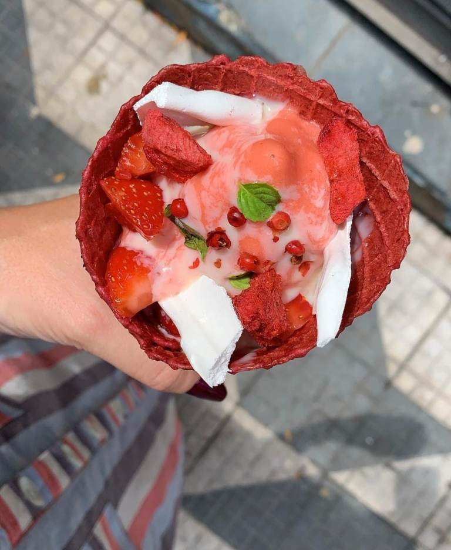 

```Comandada pelos chefs Jefferson e Janaína Rueda se surpreenda com sabores que misturam doce com bacon, por exemplo / Tina Bini```

A Sorveteria do Centro, comandada pelos premiados chefs Jefferson Rueda e Janaína Rueda, faz sucesso com seus sorvetes bem elaborados e inovadores, fato que pode ser comprovado pelas filas formadas ali diariamente – que chegam a dobrar no calor e aos finais de semana. Os sorvetes são feitos sem conservantes ou aditivos, vendidos na versão “soft’ à base de leite da fazenda ou de frutas, o famoso “sorbet”. Saindo de duas máquinas, são cinco sabores fixos, como leite, chocolate, morango, jabuticaba e leite + chocolate. Outros sabores são rotativos, em que a ideia é ter criações sazonais e misturas nada óbvias, como o sorvete à base de leite que leva bacon sequinho por cima e pururuca no meio, uma iguaria da Casa do Porco. Destaque também para o de jabuticaba com poejo (espécie de hortelã) e calda de chia, que dá um toque de doce com o crocante do suspiro.

_Sorveteria do Centro: Rua Epitácio Pessoa, 94 – República – São Paulo – SP / Funcionamento: todos os dias, das 12h às 23h / WhatsApp: (11) 94198-0318 / Delivery via iFood_


---


## Al Kaseem Gelato


---

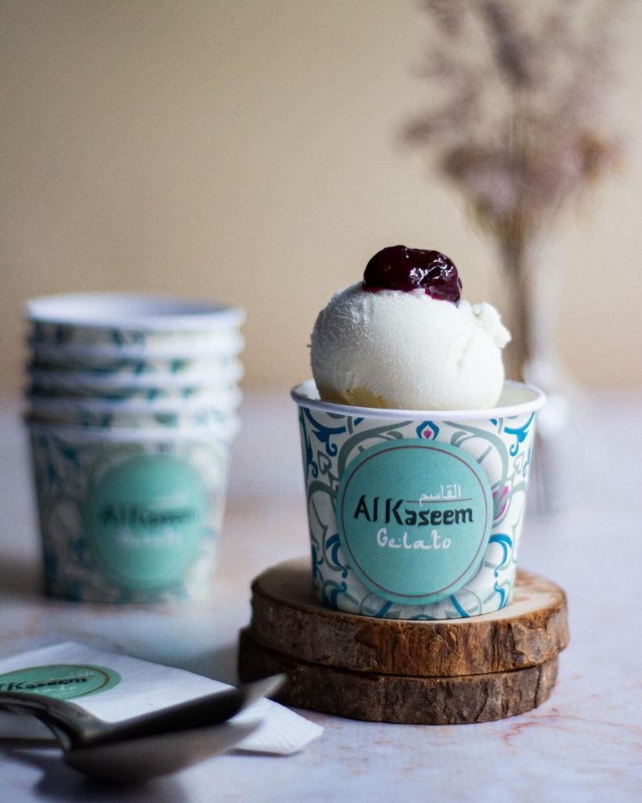 

```Al Kaseem tem sabores como o de coalhada seca árabe acompanhado de calda de frutas vermelhas / Divulgação```


A Al Kaseem Gelato é uma marca paulistana que tem à frente uma brasileira e um sírio. Os dois conseguiram misturar as técnicas dos gelatos italianos aos sabores árabes, o que resultou em sorvetes que rapidamente conquistaram uma legião de fãs – inclusive são fornecedores oficiais da sobremesa para diversos restaurantes da capital paulista. 

Espere por sabores como coalhada seca com calda de frutas vermelhas; café com cardamomo; sorvete de rosas; tâmaras; figo seco com nozes; entre outros.

_Al Kaseem Gelato: Al. dos Nhambiquaras, 1657, Moema – São Paulo – SP / WhatsApp: (11) 95089-4750 / Funcionamento: terça a domingo, das 11h às 20h / Delivery via iFood ou Rappi_


                                                                             |6|
---


# __Próxima parada, primavera: 6 destinos pelo Brasil para visitar na estação__


---


A época mais florida do ano começa oficialmente no dia 22 de setembro, mas CNN Viagem & Gastronomia já fez uma seleção de destinos que atraem visitantes por seus eventos e paisagens especiais


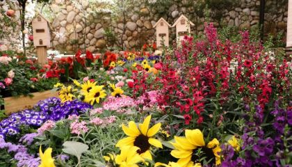 

```Descubra destinos que são a cara da primavera no Brasil expoflora```

A época mais florida do ano está chegando. A primavera começará no Brasil em 22 de setembro e segue até 21 de dezembro, quando o verão entra em cena. As temperaturas mais amenas e as flores desabrochando fazem com que lugares por todo país se tornem verdadeiros cenários de filmes.

Coloridos e agradáveis – além de renderem ótimas fotos -, esses destinos oferecem diferentes opções de passeios.

O simbolismo da época também é muito forte. Para muitos, é hora de renascer e florescer – assim como as flores que ficaram adormecidas durante um período do ano. E nada melhor do que viajar para despertar esses sentimentos.


Confira destinos pelo Brasil para visitar nesta época do ano:


---


## Holambra, São Paulo


---

Conhecida como a capital das flores, Holambra fica no interior de São Paulo e é a maior comercializadora de flores do Brasil. Visitada o ano inteiro por quem ama o tema, a cidade é uma antiga colônia holandesa.

É nela que acontece a ExpoFlora, a principal feira do assunto da América Latina. Neste ano, o evento chega à 39ª edição, entre os dias 2 e 25 de setembro, e oferece inúmeras atrações – até chuva de pétalas o visitante encontrará.

Quem vai para Holambra encontra flores por todos os lados, até nas placas de trânsito. E não é só na primavera que o destino faz sucesso. Durante todo o ano acontecem passeios em campos de flores, localizados em fazendas privadas.

Apenas agências credenciadas conseguem oferecer esse tipo de passeio aos turistas, mas não se preocupe: há muita oferta.

Quem estiver por lá, não pode deixar de visitar também pontos emblemáticos, como o Moinho dos Povos Unidos, um moinho de vento construído na tradição holandesa, considerado o mais alto moinho de vento da América Latina.

Além dele, Parque Van Gogh é outro passeio lindo, com flores, um lago e lojinhas para os turistas, além do Deck do Amor, que fica na Praça Vitória Régia. Nele, são colocados cadeados que simbolizam o amor dos casais, inspirados na ponte de Paris, a Pont Des Arts.


---


## Nova Petrópolis, Rio Grande do Sul


---


Colonizada por imigrantes alemães, Nova Petrópolis está no interior do Rio Grande do Sul, a aproximadamente 100km de Porto Alegre.

A cidade oferece parques e atrações naturais, como o Aldeia do Imigrante, Ninho das Águas e Pedras do Silêncio. Sua praça principal passou a ser conhecida popularmente como Praça das Flores por conta de seus belos jardins, com diversas espécies que impressionam os turistas.

Em setembro, a cidade recebe o Festival da Primavera. A rua Coberta – próxima à praça -, no centro da cidade, se transforma em uma grandiosa feira de jardinagem e paisagismo, o que faz com que Nova Petrópolis seja um ótimo lugar para se visitar na estação.

Eventos técnicos, concurso de fotografia, tour pelas floriculturas, oficinas temáticas, apresentações musicais, caminhadas e pedais, além comercialização de flores, atraem turistas do Brasil inteiro. O evento acontecerá de 16 a 25 de setembro.


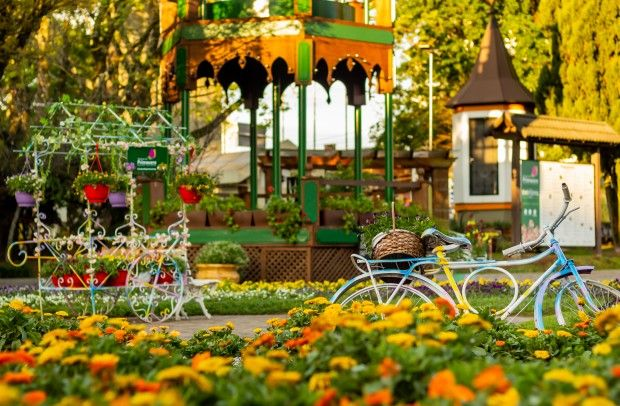 

```Nova Petrópolis, no Rio Grande do Sul, ganha Festival da Primavera em setembro/Divulgação```


---


##  Gramado e Canela, na Serra Gaúcha


---

Engana-se quem pensa que os destinos gaúchos são ótimas opções apenas no inverno. Considerada alta temporada, a estação atrai muitos turistas por suas baixíssimas temperaturas, mas a primavera não fica para trás.

A estação, inclusive, tende a ser melhor sugestão para aqueles que não gostam muito de frio e querem economizar para conhecer o destino. Nesta época, passagens e hotéis ficam bem mais em conta.

A região é famosa pelas hortênsias, que ganham (ainda mais) as ruas, praças e parques das cidades nesta estação. Os pontos turísticos ganham uma nova cara e os dias são mais quentes – o que não quer dizer que é possível dispensar os casacos da mala, uma vez que à noite a temperatura pode cair drasticamente.

Os restaurantes e pontos famosos continuam sendo imperdíveis para seu roteiro. Mas na estação, valorize também os programas ao ar livre. O que não faltam são atrativos naturais na cidade.

O Lago Negro e Lago Joaquina Rita Bier, que são artificiais, ficam ainda mais bonitos, com hortênsias e azaleias compondo o cenário. Os parques da Cachoeira, da Ferradura e do Caracol em Canela, oferecem diversas atrações com a natureza como protagonista.

O Natal Luz de Gramado, famoso por suas luzes e atrações ao ar livre, também tem início na estação. Confira outros programas para fazer na cidade neste link. 


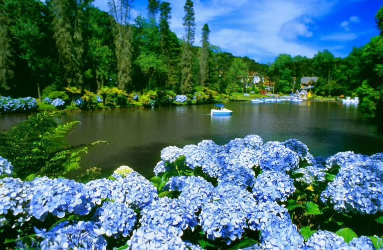 

```Lago Negro é um lago artificial de Gramado: mede 17.500 m² e tem 14 metros em sua parte mais profunda / Leonid Streliaev/Gramado Inesquecível```


---


## Curitiba, Paraná


---


Curitibatambém é conhecida por suas baixas temperaturas, mas o clima ameno da primavera transforma a cidade – que é uma das mais arborizadas do país – em um verdadeiro arco-íris.

Os inúmeros parques e bosques disponíveis, como o Do Alemão, Tanguá, Tingui e Barigui, ficam floreados e ganham turistas que pretendem apreciar a beleza e garantirem boas fotos. Em suas ruas, os ipês amarelos costumam se destacar nesta época do ano.

Um de seus principais cartões postais, o Jardim Botânico é um show à parte na estação. Seus canteiros e jardins floridos roubam a cena com diferentes cores. São milhares de mudas plantadas de diversas espécies, como Araucária, erva-mate, juvevê, tarumã, imbuia, canela preta, cedro rosa, aroeira, pimenteira, pitangueira, cerejeira, bromélias e orquídeas.

A principal atração, a estufa de 458 m2, inspirada na arquitetura europeia, abriga exemplares vegetais naturais e ornamentais da flora da Mata Atlântica, que cobre a Serra do Mar e a planície litorânea do Paraná.

A construção de ferro e 3.800 peças de vidro, em espaço aberto, impressiona os turistas durante todas as épocas do ano.


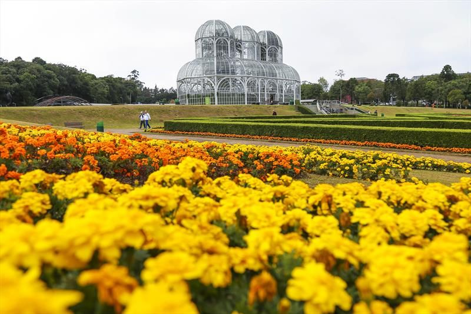 

```Um dos principais cartões postais de Curitiba, o Jardim Botânico/ Pedro Ribas/Divulgação```


---


## Joinville, Santa Catarina


---


Muita gente não imagina, mas Joinville recebe uma das maiores festas dedicadas a flores do Brasil. E, é claro, durante a primavera. Há oito décadas, sempre no mês de novembro, a Festa das Flores agita e transforma a cidade em um grande jardim. O evento acontece no Centro de Convenções e Exposições da Expoville.

A tradição começou em 1936, com a Exposição de Flores e Artes Domiciliar (EFA), criada por apaixonados pelas orquídeas nativas – muitos deles imigrantes europeus que se instalaram na região.

O objetivo era promover o cultivo e o encanto pelas flores. Ao longo dos anos, a exposição cresceu, conquistou o público e se tornou a Festa das Flores de Joinville. Só não aconteceu durante o período da Segunda Guerra Mundial.

Todos os anos recebe turistas e profissionais da área, que se surpreendem com a beleza e diversidade do evento, que promove desde exposições a competições, como concursos de jardins e orquídeas, por exemplo.

Este ano, a Festa das Flores de Joinville acontecerá de 15 a 20 de novembro.


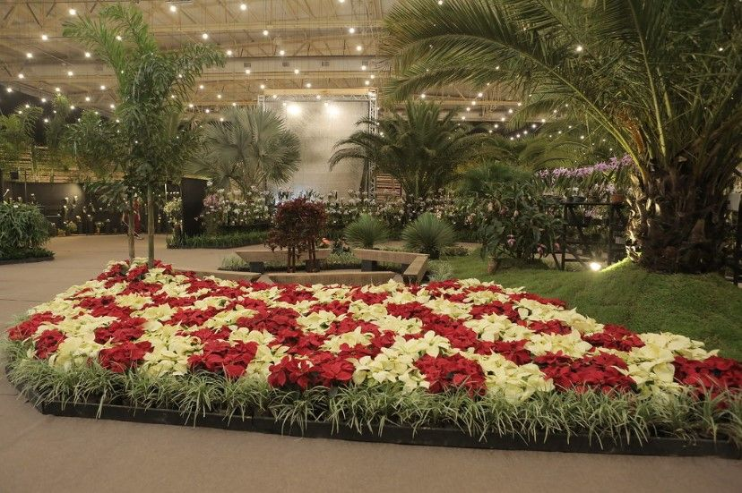 

```Festa das Flores acontece há oito décadas em Joinville, Santa Catarina/Divulgação```


---


## Cunha, São Paulo


---


Cunha, um dos maiores municípios, em área, do Estado de São Paulo, está localizada no Vale do Paraíba. E é lá que está o maior e mais famoso lavandário do país.

Com clima de montanha (tropical de altitude), no verão as temperaturas são mais altas durante o dia e mais agradáveis à noite. As chuvas são frequentes nesse período. No inverno, o clima é seco, com temperaturas amenas durante o dia e frio à noite.

Essas condições geográficas são determinantes para o cultivo da lavanda e estabelecimento d’O Lavandário em Cunha, que além de cultivar promove pesquisas e desenvolve produtos a partir da planta. As visitas acontecem de sexta a domingo e feriados, e o valor do ingresso é R$ 20.

Parques, cachoeiras e a vista da Baía de Ilha Grande também fazem parte do atrativo e podem ser aproveitados durante sua estadia na cidade.


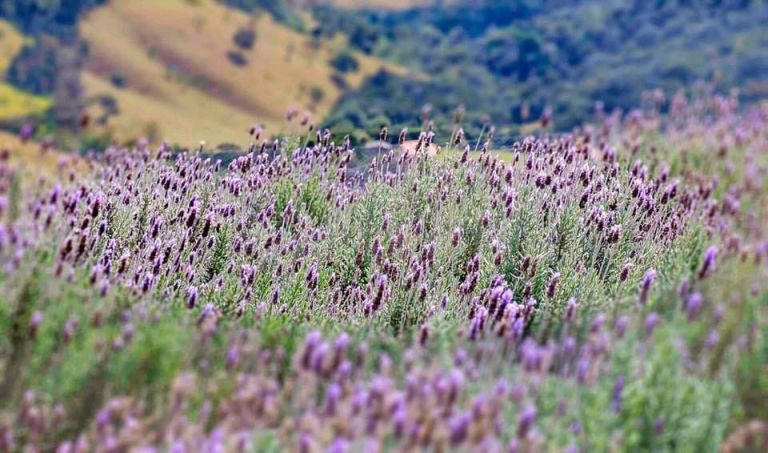 

```Em Cunha, no interior de São Paulo, está localizado o Lavandário mais famoso do país/Divulgação```
