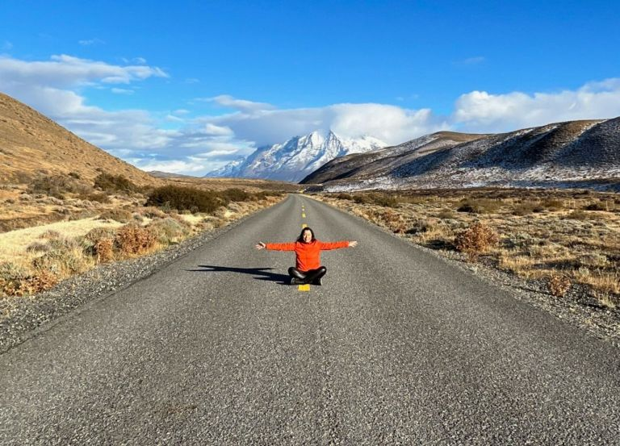

# CADERNO DE VIAGEM & GASTRONOMIA

# Escola: Gildo Veríssimo 
# Disciplina: Português 
# Professor: Marcos
# Turma: 8° B
# Aluna: Ketilly Maria 
# Data: 23/09/22

---

## __Patagônia chilena: a força da natureza em Torres del Paine__

---

Lugar único na Terra, parque na Patagônia nos presenteia com visuais que parecem ter saído da ficção; montanhas, icebergs e geleiras garantem paisagens e atividades que despertam nosso lado aventureiro

---

### A Patagônia

---

 

A Patagônia é uma região geográfica que abrange a Argentina e o Chile. Do lado chileno encontramos regiões arborizadas e cadeias de montanhas caracterizadas por picos cobertos de gelo, além de lagos com tons azulados e geleiras.

Em resumo, é uma região repleta de paisagens cinematográficas e cenários intocados pelo homem, um antro para quem ama atividades ao ar livre, ecoturismo e pitadas de aventura.

Não são somente estas pessoas, porém, que são contempladas por aqui: o bacana é que a Patagônia tem uma série de expedições que podem ser feitas de várias maneiras. A beleza deste pedaço do Chile reside no fato de obedecermos a contemplação da natureza.

Caminhadas longas podem ser feitas, mas há certos trajetos, por exemplo, que podem ser acessíveis de carro. Os passeios são adaptáveis.

Inclusive, se quisermos um dia mais relaxante, uma opção é tomar vinho no hotel enquanto apreciamos a paisagem – ou seja, são várias as possibilidades.

Uma das maneiras mais populares de chegarmos à Patagônia chilena é via Santiago, com voos que ligam a capital até Punta Arenas, cidade próxima da extremidade da região mais sul do país.

Vários são os parques que fazem parte da Patagônia chilena, mas o maior e mais conhecido – e também imperdível – é o Torres del Paine.

---

### Parque Nacional Torres del Paine

---

Uma das maiores e mais importantes portas de entrada para se ter um gosto verdadeiro da Patagônia chilena é o Parque Nacional Torres del Paine. Criado em 1959, o parque fica na região de Magalhães e ocupa cerca de 230 mil hectares de área.

Paisagens que parecem ter saído de um filme de ficção nos deixam para lá de encantados. Florestas, colinas, quedas d’água, lagos glaciares, vistas privilegiadas para picos nevados e campos de gelo: aqui, ficamos maravilhados com tudo isso e muito mais.

É de longe um dos lugares mais lindos da América do Sul, acessível a cerca de 112 km da cidade de Puerto Natales. E deixo avisado que, mesmo no caminho, não há como não parar o carro e contemplar as paisagens em volta: esse já é um passeio e tanto.

Além das paisagens fascinantes e atividades que nos conectam com o ambiente natural, há também toda uma história geológica por trás do parque e da Patagônia que podemos conferir de perto com nossos próprios sentidos.

---

Lodge Explora e informações básicas

---

O Torres del Paine conta com centro de visitantes, área para camping e também lodges e hotéis. Um deles é o Explora, que foi uma das aconchegantes bases dentro do parque nacional durante as gravações do programa.

Com apenas 49 quartos, a impressão é de estarmos num hotel mais íntimo, construído com madeiras e integrado à paisagem ao redor – a arquitetura foi pensada de forma a interferir o menos possível com o entorno.

Erguido há mais de duas décadas, o hotel, inserido nesta localização única, possui janelas que enquadram perfeitamente as vistas para as margens do Lago Pehoé e para o Maciço del Paine.

Se as vistas já nos deixam relaxados, o spa com massagens, piscina coberta e climatizada junto à sauna, ou ainda as jacuzzis com vista para o Rio Paine, nos ajuda na tarefa de ficarmos ainda mais despreocupados.

Vinhos de rótulos chilenos, entre brancos, tintos e rosés, são servidos nas mesas do restaurante junto de pratos bem elaborados com ingredientes locais.
A partir do hotel são mais de 40 expedições que podemos fazer nesta área protegida, onde caminhamos, pisamos na terra, fazemos trilha ou ainda percorremos trajetos a bordo de veículos para pontos mais distantes e subimos numa embarcação em meio às geleiras.

O dia a dia no Explora é assim: acordamos bem cedo, nos encontramos com o guia, juntamos com o grupo e comparecemos ao briefing do passeio do dia.

O parque também é dividido em dois principais circuitos, chamados de “W” e de “O”, os quais abrangem trekking nos principais pontos que podem levar até alguns dias para serem percorridos inteiramente.

Vale ressaltar que não há sinal de internet ou telefone nas trilhas internas do parque, portanto, é uma boa oportunidade de ficarmos, inevitavelmente, desconectados por vários dias.

E tudo isso com uma sensação térmica de muitos graus abaixo do que aponta o termômetro: rajadas fortes e geladas de vento são onipresentes, chegando normalmente até os 40 km/h. Por isso, esteja muito bem agasalhada.

A própria administração do parque alerta que o clima na Patagônia muda rapidamente. Portanto, camadas de roupas apropriadas para resistir à chuva, vento e neve são importantes.

Fora os lembretes acima, o parque também cobra uma taxa e possui horários específicos de entrada. É sempre bom checar os preços, que variam de US$ 35 a US$ 49, e os horários no site oficial.

---

Pontos principais imperdíveis

---
