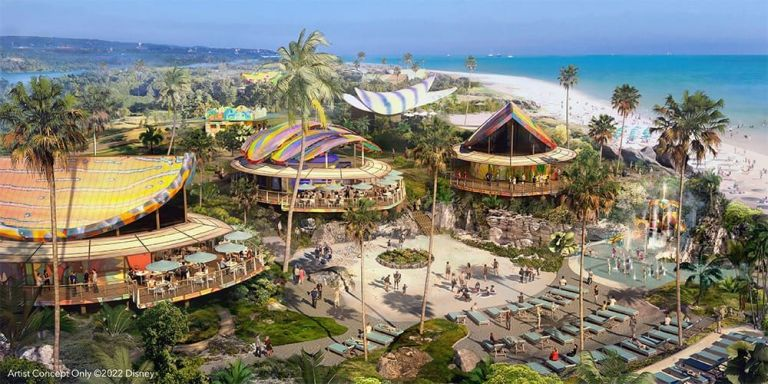

# CADERNO DE VIAGEM & GASTRONOMIA

# Escola: Gildo Veríssimo 
# Disciplina: Português 
# Professor: Marcos
# Turma: 8° B
# Aluna: Ketilly Maria 
# Data: 23/09/22


                                                                             
                                                                             |1|
                                                                             

---


# __Patagônia chilena: a força da natureza em Torres del Paine__

---


Lugar único na Terra, parque na Patagônia nos presenteia com visuais que parecem ter saído da ficção; montanhas, icebergs e geleiras garantem paisagens e atividades que despertam nosso lado aventureiro


---


## A Patagônia


---


 


A Patagônia é uma região geográfica que abrange a Argentina e o Chile. Do lado chileno encontramos regiões arborizadas e cadeias de montanhas caracterizadas por picos cobertos de gelo, além de lagos com tons azulados e geleiras.

Em resumo, é uma região repleta de paisagens cinematográficas e cenários intocados pelo homem, um antro para quem ama atividades ao ar livre, ecoturismo e pitadas de aventura.

Não são somente estas pessoas, porém, que são contempladas por aqui: o bacana é que a Patagônia tem uma série de expedições que podem ser feitas de várias maneiras. A beleza deste pedaço do Chile reside no fato de obedecermos a contemplação da natureza.

Caminhadas longas podem ser feitas, mas há certos trajetos, por exemplo, que podem ser acessíveis de carro. Os passeios são adaptáveis.

Inclusive, se quisermos um dia mais relaxante, uma opção é tomar vinho no hotel enquanto apreciamos a paisagem – ou seja, são várias as possibilidades.

Uma das maneiras mais populares de chegarmos à Patagônia chilena é via Santiago, com voos que ligam a capital até Punta Arenas, cidade próxima da extremidade da região mais sul do país.

Vários são os parques que fazem parte da Patagônia chilena, mas o maior e mais conhecido – e também imperdível – é o Torres del Paine.


---


## Parque Nacional Torres del Paine


---


Uma das maiores e mais importantes portas de entrada para se ter um gosto verdadeiro da Patagônia chilena é o Parque Nacional Torres del Paine. Criado em 1959, o parque fica na região de Magalhães e ocupa cerca de 230 mil hectares de área.

Paisagens que parecem ter saído de um filme de ficção nos deixam para lá de encantados. Florestas, colinas, quedas d’água, lagos glaciares, vistas privilegiadas para picos nevados e campos de gelo: aqui, ficamos maravilhados com tudo isso e muito mais.

É de longe um dos lugares mais lindos da América do Sul, acessível a cerca de 112 km da cidade de Puerto Natales. E deixo avisado que, mesmo no caminho, não há como não parar o carro e contemplar as paisagens em volta: esse já é um passeio e tanto.

Além das paisagens fascinantes e atividades que nos conectam com o ambiente natural, há também toda uma história geológica por trás do parque e da Patagônia que podemos conferir de perto com nossos próprios sentidos.


---


## Lodge Explora e informações básicas


---


O Torres del Paine conta com centro de visitantes, área para camping e também lodges e hotéis. Um deles é o Explora, que foi uma das aconchegantes bases dentro do parque nacional durante as gravações do programa.

Com apenas 49 quartos, a impressão é de estarmos num hotel mais íntimo, construído com madeiras e integrado à paisagem ao redor – a arquitetura foi pensada de forma a interferir o menos possível com o entorno.

Erguido há mais de duas décadas, o hotel, inserido nesta localização única, possui janelas que enquadram perfeitamente as vistas para as margens do Lago Pehoé e para o Maciço del Paine.

Se as vistas já nos deixam relaxados, o spa com massagens, piscina coberta e climatizada junto à sauna, ou ainda as jacuzzis com vista para o Rio Paine, nos ajuda na tarefa de ficarmos ainda mais despreocupados.

Vinhos de rótulos chilenos, entre brancos, tintos e rosés, são servidos nas mesas do restaurante junto de pratos bem elaborados com ingredientes locais.
A partir do hotel são mais de 40 expedições que podemos fazer nesta área protegida, onde caminhamos, pisamos na terra, fazemos trilha ou ainda percorremos trajetos a bordo de veículos para pontos mais distantes e subimos numa embarcação em meio às geleiras.

O dia a dia no Explora é assim: acordamos bem cedo, nos encontramos com o guia, juntamos com o grupo e comparecemos ao briefing do passeio do dia.

O parque também é dividido em dois principais circuitos, chamados de “W” e de “O”, os quais abrangem trekking nos principais pontos que podem levar até alguns dias para serem percorridos inteiramente.

Vale ressaltar que não há sinal de internet ou telefone nas trilhas internas do parque, portanto, é uma boa oportunidade de ficarmos, inevitavelmente, desconectados por vários dias.

E tudo isso com uma sensação térmica de muitos graus abaixo do que aponta o termômetro: rajadas fortes e geladas de vento são onipresentes, chegando normalmente até os 40 km/h. Por isso, esteja muito bem agasalhada.

A própria administração do parque alerta que o clima na Patagônia muda rapidamente. Portanto, camadas de roupas apropriadas para resistir à chuva, vento e neve são importantes.

Fora os lembretes acima, o parque também cobra uma taxa e possui horários específicos de entrada. É sempre bom checar os preços, que variam de US$ 35 a US$ 49, e os horários no site oficial.


---


## Pontos principais imperdíveis


---


Estar no Parque Nacional Torres del Paine é notar que o clima altera a todo momento e que as paisagens mudam a cada hora, ora com a incidência dos raios solares, ora com sombras, ora com cores de águas diferentes. É uma dança da natureza imperdível.


As principais atividades que podemos experimentar por aqui envolvem hikes, montanhas, cavalgadas, passeio de barco pelo glaciar Grey e passeios autoguiados, passando por lagos, lagunas, cachoeiras, vales e miradouros.

 


A fauna também dá as caras pelo parque e nos deparamos com diversas espécies ao longo dos trajetos. Em algumas trilhas ficamos bem perto de vários guanacos, mamíferos ruminantes nativos da América do Sul. Interessante é que o parque concentra também um elevado número de pumas, aproximadamente 100.

Caso nos encontremos com um puma, a administração do parque aconselha manter a calma e não se aproximar dos animais. A recomendação é: “Não corra e se afaste lentamente olhando-o nos olhos. Fique de pé, tente parecer maior, faça barulhos altos”.

--- 


Lago Sarmiento


---


A começar, depois de já estabelecida no hotel, o Lago Sarmiento foi uma boa pedida para iniciar a aventura pelo parque. Com um trekking de média dificuldade, chegamos à beirada do lago, que recebe o nome do explorador espanhol Pedro Sarmiento de Gamboa.

De longe, notamos que algumas bordas do lago se assemelham com pequenas praias. Aqui, porém, além de visuais incríveis, nos deparamos com milhares de anos de geologia na caminhada pelas bordas, as quais são o lar de formações chamadas de trombolitos.

Estas formações nos remetem aos primórdios do planeta e são o resultado do depósito de cálcio e atividade de microorganismos dos mais antigos da Terra. Mais especificamente, os trombolitos são o resultado da fotossíntese que as cianobactérias fazem no lago.

Poucos são os lugares no mundo onde trombolitos são encontrados e, no Lago Sarmiento, temos a oportunidade de ver uma parte da história da Terra diante de nossos olhos e pés. É para lá de especial.


---


Lago Pehoé, Maciço del Paine e Mirantes


---


Próximo do hotel Explora fica o Lago Pehoé, que concentra uma alta quantidade de minerais. Suas águas cristalinas ficam de um azul brilhante em determinados momentos do dia e somos agraciados com uma incomparável beleza paisagística com o Maciço del Paine ao fundo.

Daqui também conseguimos avistar os Los Cuernos del Paine, os “chifres”, título dado ao conjunto de picos de granito pontiagudos que se erguem a mais de 2 mil metros de altura.

O bacana é andar nas beiradas do lago, onde, literalmente, não encontramos mais ninguém: somos nós e a natureza, nada mais.

Torres del Paine também dispõe de cerca de seis mirantes em sua área. Podemos percorrer estes miradouros de carro, em que, como de costume, encontramos cenários deslumbrantes, que nos fornecem ângulos diferenciados para o Maciço Paine.


---


Passeio de barco pelo Glaciar Grey


---


Percorrer o Glaciar Grey é um dos programas mais fantásticos que podemos fazer no parque nacional. É uma experiência que fica em nossas lembranças para sempre, daquelas atividades que temos que fazer uma vez na vida.

O Lago Grey, com mais de 500 metros de profundidade, leva o nome do Glaciar Grey, a terceira maior extensão de gelo continental do mundo, perdendo apenas para Antártica e Groelândia – lembrando que 80% das geleiras da América do Sul ficam no Chile.

O Parque Nacional Torres del Paine abrange só uma parte do glaciar, mas que já é magnífico em todos os detalhes.

Uma das maneiras mais práticas de percorrer o lago e admirar as formações de gelo de azul-intenso é navegando por suas águas. Para chegarmos até o barco – agendado à parte com o agências de turismo ou mesmo o Hotel Explora – precisamos caminhar por uma praia de pedrinhas soltas.

O passeio dura por volta de três horas e nos permite chegar bem perto das geleiras. Vamos notando vários icebergs no caminho, os quais foram se desprendendo do Glaciar Grey.

A cor azul intensa da geleira é o que mais salta aos nossos olhos. É esplêndido.

Por outro lado, temos que nos agasalhar de maneira reforçada. Os fortes ventos que experimentamos no lado externo do barco são cortantes, ainda mais quando chegamos mais perto do glaciar.

Em determinado momento, a tripulação pesca alguns pedaços de gelo do lago. O propósito? Fazer um drinque usando o gelo que vem do glaciar. É uma experiência, no mínimo, divertida.

Segundo a tripulação, o gelo para nossos drinques datava de cerca de oito mil anos – quanto mais transparente, mais antigo o gelo é. O brinde é feito com pisco sour ou com drinque não alcoólico bem ao estilo patagônico.

Além da navegação, os mais aventureiros podem ainda encontrar algumas trilhas do parque que desembocam no lago, como os circuitos “W” e “O”.


---


Lago Nordenskjold


---


A partir do hotel Explora, a trilha até o Lago Nordenskjold é de seis quilômetros. O lago, que possui belas cores, fica próximo dos Cuernos del Paine, os chifres de Torres del Paine, que são um dos símbolos do parque.

Novamente, o vento é intenso e chega a nos carregar. No trajeto há até placas com sinalização da velocidade dos ventos do dia e algumas recomendações: somos aconselhados a não realizar atividades se a ventania passar de 80 km/h.

Com paisagens surreais lindíssimas, que nos arrancam um “uau”, o caminho também nos lembra de um passado triste: entre 2011 e 2012 um incêndio florestal, com suspeitas de ter decorrido da ação humana, devastou mais de 17 mil hectares florestais do parque.

Em alguns trechos do trajeto ainda podemos ver resquícios do incêndio.

Apesar da trilha nos exigir certo esforço, somos recompensados ao chegarmos até as redondezas do lago. Aqui nos surpreendemos com pouco, que já é muito: com a vista, com a natureza e com as paisagens de cinema.

As cores da água são maravilhosas e os fundos são surreais. Inevitavelmente ficamos em silêncio contemplando esta beleza natural. Às vezes, ouvimos barulhos que parecem trovões, mas que, na verdade, são movimentações repentinas da neve.

O café quente da garrafa térmica ajuda a aquecer o corpo, já que as vista aquecem a alma.

Após a caminhada, lembramos que, em certas ocasiões, ficamos mais preocupados com o caminho do que com o presente: o trajeto é uma boa lembrança de que precisamos nos permitir a ver o diferente e sair da zona de conforto. Vale a pena.


                                                                             |2|
                                      


---


# __Disney anuncia lançamento de 6º navio de sua frota e novidade em ilha nas Bahamas__


---


O Disney Treasure será inspirado nas aventuras de Aladdin; empresa também divulgou cruzeiros "para lugar nenhum”, em que o navio é o próprio destino

 


Um novo gigante dos mares será lançado nas águas em 2024: na semana passada, a Disney anunciou a inauguração do sexto navio de sua frota, o Disney Treasure, que terá o hall principal inspirado em “Aladdin”.

De acordo com a empresa, o inédito navio será inteiramente decorado pelo tema da aventura, inspiração vinda do amor de Walt Disney por novas descobertas.


“Inspirado pela grandeza e mistério de um palácio dourado, o Grand Hall se baseia em influências do mundo real da Ásia e da África e presta homenagem à terra distante de Agrabah, do conto de Aladdin”, compartilhou a companhia.

Uma estátua do personagem junto de Jasmine e do Tapete Mágico ficará disposta no átrio principal – uma tradição dos navios da Disney.


 

```Projeto mostra como será o átrio do Disney Treasure, com detalhe da estátua de Aladdin ao lado da escada / Divulgação```


O Disney Treasure é a segunda das três embarcações planejadas pela empresa até 2025. Neste ano, o Disney Wish fez suas primeiras viagens com passageiros pelo Caribe, no mês de julho.

Assim como o Disney Wish, é esperado que o Disney Treasure tenha cerca de 1.254 cabines.


---


## Novidades nas Bahamas


---


 

```Arte conceitual mostra como será o novo destino da Disney nas Bahamas, o Lighthouse Point, na ilha de Eleuthera / Divulgação```


Além da inédita embarcação, outras novidades foram divulgadas durante a D23 Expo 2022, evento oficial da The Walt Disney Company, realizado no centro de convenções em frente aos parques da Disney na Califórnia, e que contou ainda com palestras, presença de artistas e painéis.

Entre elas, os detalhes sobre o segundo destino de ilha da Disney nas Bahamas: o Lighthouse Point, localizado na ilha de Eleuthera, foi escolhido como novo ponto de parada da companhia.

Além das praias de areias brancas e águas azul-turquesa, são previstos centros de entretenimento, de compras, locais para refeições e um playground aquático, assim como um pavilhão cultural dedicado a histórias e tradições locais.

“Será um vibrante retiro de praia com a cor e a energia das Bahamas”, disse a Disney em comunicado.

A companhia ainda afirmou que 90% da energia será solar e que empregará práticas de construção sustentável.


---


## Cruzeiros na Austrália e Nova Zelândia


---


As primeiras viagens da empresa partindo da Austrália e da Nova Zelândia também foram anunciadas.

De outubro de 2023 a fevereiro de 2024, o navio Disney Wonder partirá de Sydney, Melbourne e Brisbane, na Austrália, assim como de Auckland, na Nova Zelândia, como parte de uma série de itinerários batizada de “Disney Magic at Sea”.

Os cruzeiros são “para lugar nenhum” e o navio é o próprio destino – a programação a bordo mergulhará os hóspedes nos universos da Pixar, da Marvel e de Star Wars.

As viagens de reposicionamento entre Honolulu, no Havaí, e Sydney, na Austrália, passarão ainda por Fiji e Samoa, destinos insulares no Pacífico Sul. As reservas abrem no próximo dia 6 de outubro.


                                                                            |3|


---


# __4 chefs brasileiros estão entre os 100 melhores do mundo; Alex Atala fica em 10º__


---


Acabam de ser divulgados os vencedores da sexta edição do The Best Chef Awards; espanhol Dabiz Muñoz, do restaurante DiverXo, é o melhor pelo 2º ano consecutivo


 


```Final do The Best Chef Awards, premiação que destaca os melhores chefs do mundo
Edward Trzeciakiewicz


A sexta edição do The Best Chef Awards, premiação que destaca os melhores chefs do mundo e realizada desde 2017, elegeu na noite dessa terça-feira (20), o madrilenho Dabiz Muñoz como o melhor chef do mundo.

No comando do DiverXo, restaurante com três estrelas Michelin na capital espanhola que aposta numa cozinha criativa e de vanguarda, o jovem chef já havia sido coroado como o nº 1 do mundo na edição passada. Desde o primeiro ano da premiação, o profissional espanhol nunca saiu do top 10.


Antes de abrir a própria casa, Muñoz ganhou experiência em Madrid e também em Londres, onde chegou a trabalhar no Nobu.

Segundo as considerações do The Best Chef Awards, ele “construiu uma reputação como um aventureiro pioneiro e criativo. Ainda na casa dos trinta anos, o chef surpreende continuamente com a sua abordagem única à cozinha”.


 


O madrilenho Dabiz Muñoz é o melhor chef do mundo em 2022 / Edward Trzeciakiewicz


---


## Brasileiros entre os 100 melhores


---
